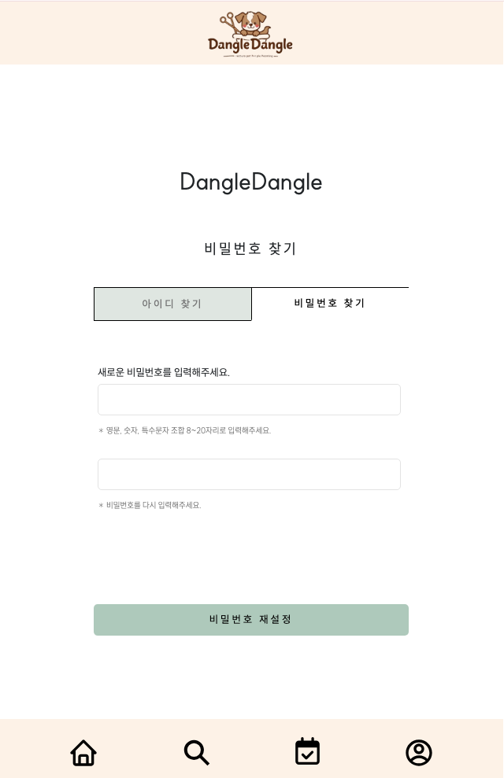

# 🐾 Dangle-Dangle 소개

## About Us
반려동물 미용 예약 서비스를 제공합니다!  
쉽고 편리한 예약 시스템을 통한 반려동물을 위한 플랫폼입니다

## 개발 일정
- **개발 기간** : 2025/02/17 ~ 진행중

## 프로젝트 설계
### 🎨 화면 구상(Figma)
- **색상 코드**

- **화면 디자인**

## 프론트엔드
### Vite + React + TypeScript
📍 **회원가입**

  
  
  

   

📍 **아이디 찾기**

  
  

   

📍 **비밀번호 찾기**

  
  

   

📍 **메인 홈 + 프로필화면**

  
  
  

   

📍 **매장 검색 + 매장 상세**

  
  

   

📍 **매장상세: 메뉴 / 디자이너 / 리뷰**

  
  
  

   

📍 **예약**

  
  
  

