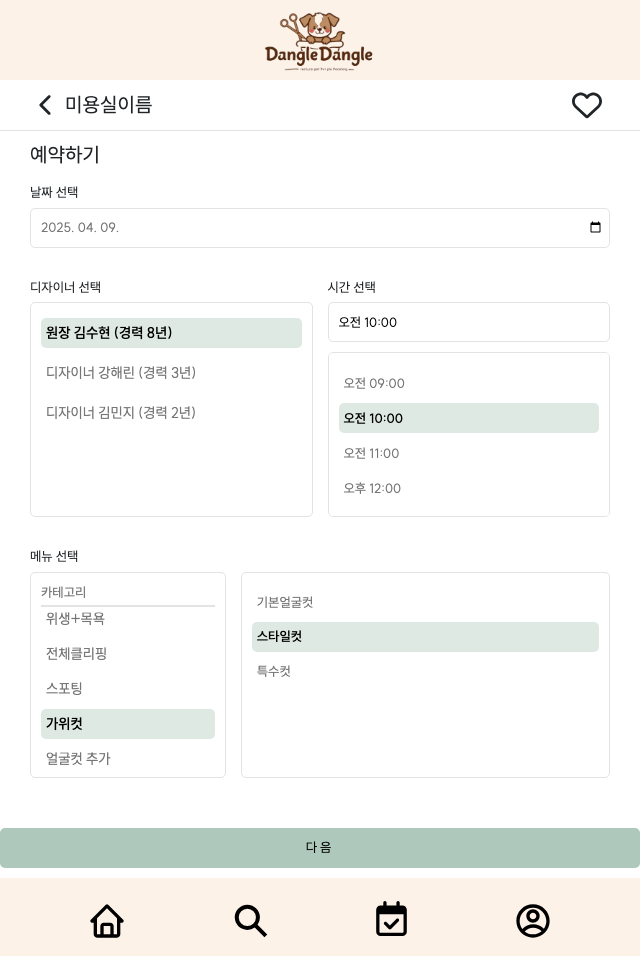

# 🐾 Dangle-Dangle 소개

## About Us
반려동물 미용 예약 서비스를 제공합니다!  
쉽고 편리한 예약 시스템을 통한 반려동물을 위한 플랫폼입니다

- **출처** : 2023 동물복지국민의조사 결과

- 최근 반려동물 양육 비율이 매년 증가하고 있는 추세에 따라, 반려동물 관련 서비스에 대한 수요도 늘어나고 있습니다.

- 저 또한 반려인으로서 미용실 예약을 DM이나 전화로 해야 하는 번거로움을 경험하면서, 이를 해결할 수 있는 방법을 고민하게 되었습니다.
  
- 이번 프로젝트를 통해 사용자들이 간편하게 온라인으로 미용 예약을 할 수 있으며, 반려동물과 함께하는 사람들이 더 편리하게 서비스를 이용할 수 있습니다.

   

## 개발 일정
- **개발 기간** : 2025/02/17 ~ 진행중
- 진행과정 참고 : https://www.notion.so/Content-Calendar-1aff1954175080939f03f632faf8eaa2

   

## 개발환경 및 기술스택
| 항목 | 내용 |
|---|---|
| **프로그래밍 언어** | Java 17 |
| **프론트엔드** | React 19.0.0, TypeScript 5.7.2 |
| **패키지 상태관리** | Yarn
| **프레임워크** | Spring Boot 3.3.8 |
| **빌드 도구** | gradle 8.12.1 |
| **데이터베이스(DB)** | PostgreSQL 16.8 |
| **데이터베이스 연동** | MyBatis |
| **개발 도구(IDE)** | IntelliJ IDEA Ultimate, Visual Studio Code |

   

## 프로젝트 설계
### 🎨 화면 구상(Figma)
- **색상 코드**

- **화면 디자인**

   

## 프론트엔드
### Vite + React + TypeScript
📍 **회원가입**

  
  
  

   

📍 **아이디 찾기**

  
  

   

📍 **비밀번호 찾기**

  
  

   

📍 **메인 홈 + 프로필화면**

  
  
  

   

📍 **매장 검색 + 매장 상세**

  
  

   

📍 **매장상세: 메뉴 / 디자이너 / 리뷰**

  
  
  

   

📍 **예약하기**

  
  
  

   

📍 **예약내역**

  
  
  

